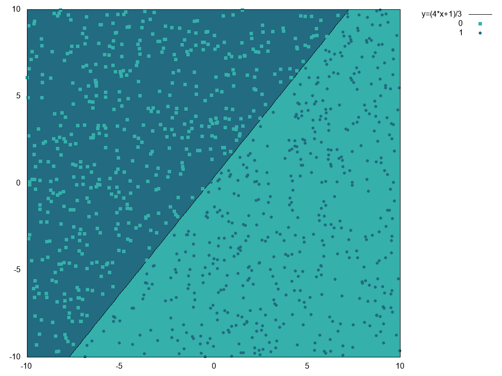

# Machine Learning Education
Simple examples to learn machine learning

## Single formal neuron
A single formal neuron with fixed weights and bias is implemented. It is then used to classify input in 2D. Considering the weights, the neuron is supposed to classify input to each side of the line which equation is y=(4x+1)/3.

The following picture shows the line (yellow triangles), and some random input points. Each input point goes through the neuron. The neuron output is the classification of the input. In the picture, the color of an input point indicates the classification decided by the neuron.

