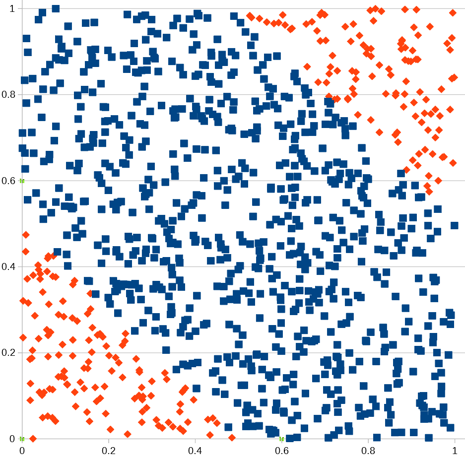

# Machine Learning Education
Simple examples to learn machine learning in C++

## [Single formal neuron](SingleFormalNeuron/main.cpp)
A single formal neuron with fixed weights and bias is implemented. It is then used to classify input in 2D. Considering the weights, the neuron is supposed to classify input to each side of the line which equation is y=(4x+1)/3.

The following picture shows the line (yellow triangles), and some random input points. Each input point goes through the neuron. The neuron output is the classification of the input. In the picture, the color of an input point indicates the classification decided by the neuron.

## [Single formal neuron training](SingleFormalNeuronTraining/main.cpp)
The goal of training is to adapt the weights and bias so the neuron is able to classify correctly data with known classification. It is supervised learning. The training algorithm for a single formal neuron is implemented.

## [First neural network: the XOR problem](XORNeuralNetwork/main.cpp)
The formal neuron is limited to the input patterns linearly separable. The XOR problem cannot be solved with a single formal neuron. In this example, the association of 3 neurons (2 in a hidden layer, and one in the output layer) is able to solve the XOR problem.

## [Linear regression](LinearRegression/main.cpp)
In this example, we consider a set of observations of the selling price of houses considering some house properties. The goal is to propose a linear model of the price from the observations. An evaluation of the model is introduced, and a method to compute the model coefficients.
